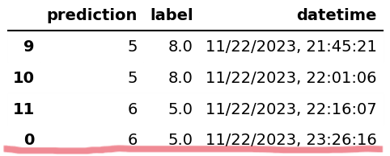
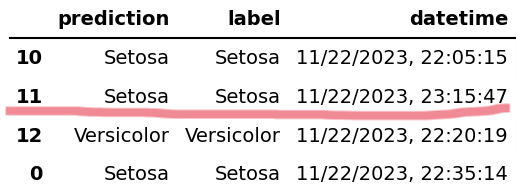
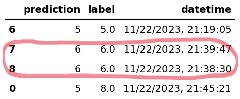

# ID2223Lab1
This repository is Lab 1 for ID2223 Scalable ML and DL in KTH. It based on [Iris Serverless ML System](https://github.com/dengty1998/id2223kth.github.io/tree/master/src/serverless-ml-intro)
from the course repository.

This Lab contains two tasks:

**Task1**: use the code about iris flower identification provided by the course to learn how to implement the serverless ML systems. 
**Task2** : build a serverless ML system for the wine quality dataset to implement the wine quality prediction function.

The code in this repo is **only** for Task2. The code of Task1 can be found in the previous link.

This repo is created for submission. Here is the related [repo](https://github.com/wenjianma/ID2223Lab1Task2) held by Wenjian.

## ID2223Lab1Task1
In this task, we follow the lab tutorial. By doing this task, we learned the knowledge about how to use websites and tools like hopsworks.ai, modal.com, huggingface.com etc.
This task has three sub-tasks.

1. Build and run iris-eda-and-backfill-feature-group.ipynb to make use the features from hopsworks.ai. Build and run the feature pipeline iris-feature-daily-pipeline on Modal.
2. Run the training pipeline iris-training-pipeline.ipynb using the data (features, labels) from hopsworks.ai and save the model to hopsworks.ai.
3. Build and run the inference pipeline iris-batch-inference-pipeline.py using the data from hopsworks.ai and send the predictions to hopsworks.ai. Then build a Gradio UI (Iris UI + Iris Monitor UI) on Hugging Face Spaces.

By doing this task, we learned the knowledge about how to use these tools and laid the foundation of doing Task2.

## ID2223Lab1Task2
In this task, we use the similar method as Task1 to build a Serverless ML system for the Wine Quality Dataset to predict the quality of the wine.

### How to Run
1. Clone this repo
2. Configure the Canda virtual environment and install requirements
3. Create accounts on hopsworks.ai and modal.com, create/cofigure necessary API keys and tokens
4. Run *wine-eda-and-backfill-feature-group.ipynb*, *wine-feature-pipeline-daily.py*, *wine-training-pipeline.ipynb* and *wine-batch-inference-pipeline.py* in order
5. Run *app.py* in folder *huggingface-spaces-wine* and *huggingface-spaces-wine-monitor* to see what will happen =）

### Implementation
The implementation includes 4 source code files. The description of the source code files is as follows.

#### *wine-eda-and-backfill-feature-group.ipynb*
This file cleans the data in *wine.csv*. It fill the missing data by using *fillna()* and transform categorical variable (in this case : type) into numerical variables by using *get_dummies()*.  Then it drops the columns that don't have predictive power by using Pearson correlation coefficient. It also implement some data visualization. Then it uploads the features to a feature group in hopsworks as a Feature Group. 

#### *wine-feature-pipeline-daily.py*
This file is deployed on cloud by using [Modal](https://modal.com/). It generates a new wine to the dataframe every day.

#### *wine-training-pipeline.ipynb*
This file trains the ML model and then upload the model to the hopsworks model registry.

#### *wine-batch-inference-pipeline.py*
This file get data from feature store and make the prediction and upload the prediction results to hopsworks.ai. 

### Gradio app
https://huggingface.co/Dengty

## Contributors
The contributors of this repo are Tianyu Deng and Wenjian Ma.

## What is interesting

### Time difference

I deployed the Modal apps iris_daily and wine_daily in Helsinki, Finland. When I set the schedule for re-execution to occur once a day, everything seemed to be going well. However, when I came back to Stockholm, Sweden and tested the code before the presentation, a tiny but interesting error happened: 

I changed *schedule=modal.Period(days=1)* to *schedule=modal.Period(minutes=15)* for testing. I found that the generated iris or wine had a wrong timestamp which was 1 hour earlier than expected. Then I try to generate a iris or wine manually and locally, and it had a correct timestamp. 

I'm sure the reason is time difference. I guess Modal stores local date-time and set timestamps according to this. 

### Queue order

I didn't learn the architecture of Hopsworks or Modal. Judging from the results, at least the order of the message queue was wrong. 

I noticed that Hopsworks uses Kafka which can guarantee message ordering. Maybe there was an error in Yarn's task allocation? Or does the error appear on the Modal side? 